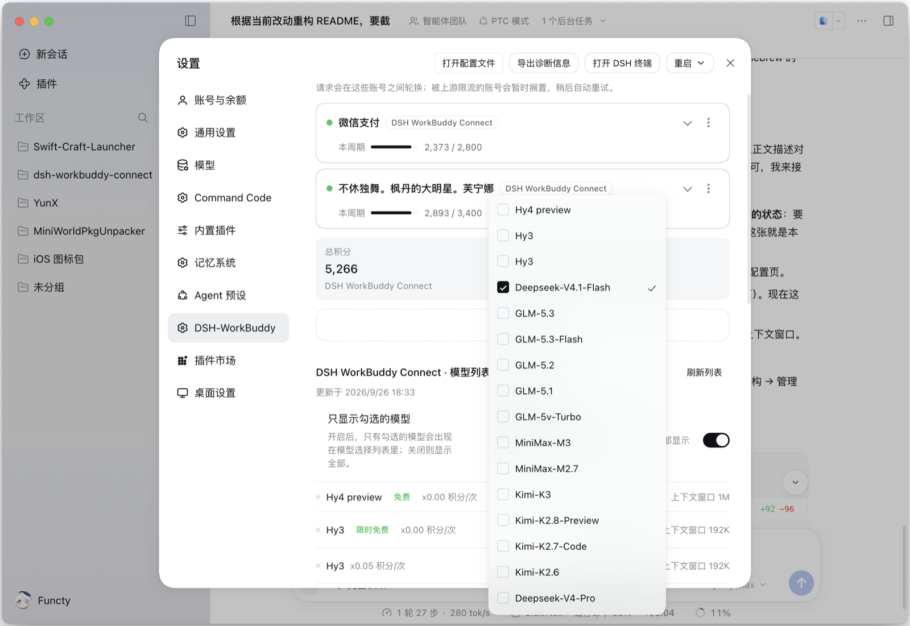
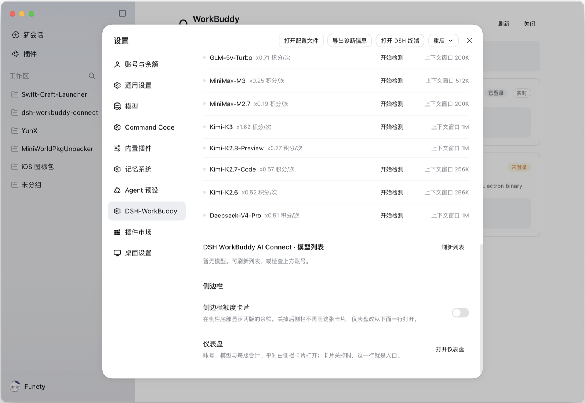

# DSH WorkBuddy Connect


[](https://github.com/functy23/dsh-workbuddy-connect/blob/main/package.json)
[](https://github.com/functy23/dsh-workbuddy-connect)
[](./LICENSE)
[](https://github.com/deepseek-ai/deepseek-harness)


[English](./README.en.md) | 中文


将 WorkBuddy 桌面 App 中包含的各种模型（GLM-5.3、GLM-5.2、DeepSeek-V4-Pro、DeepSeek-V4-Flash、Kimi-K3、MiniMax-M3 、Hy3等）自动接入 DeepSeek Harness，实现在 DSH 对话窗口里零配置使用。

国内版 **WorkBuddy** 与国际版 **WorkBuddy AI** 同时支持：装哪个 App 就出现哪个模型分组，两个都装就两组并存，各自用自己的账号与积分。


## 功能

- **开箱即用**：安装和启用插件后，在 DSH 中直接使用，无需额外配置。


- **国内版与国际版并存**：国内版显示为「WorkBuddy」分组，国际版（WorkBuddy AI）显示为「WorkBuddy AI」分组。两版的模型、账号和积分互不混用，各有**自己的账号池**，页面上的数字也始终**两版并列**。

  分组出现与否取决于该版**账号池是否为空**，而不是桌面 App 是否在线：首次在桌面 App 登录后账号会被记入账号池并长期保留，之后即便桌面 App 退出登录，分组依然可用（凭据已由插件保存）。


- **图片输入**：大部分模型支持发图，在对话里直接粘贴或拖入图片即可（GLM-5.3-Flash、GLM-5.2、DeepSeek-V4 系列等）；少数只支持文字的模型（如 GLM-5.1）会明确提示不支持。


- **推理档位**：WorkBuddy 明确声明的档位会直接显示，例如 GLM-5.3 和 GLM-5.3-Flash 可选 low / high / max。对于部分没有声明可选档位的模型，Web 和 Desktop 可在模型选择器中点击「推理等级」手动检测；检测会发送少量请求，可能消耗积分。未检测或没有可用档位的模型仍使用 WorkBuddy 的默认档位。


- **信息查看与检测**：设置 → **DSH-WorkBuddy** 里可以查看账号、令牌有效期、剩余积分和模型优惠，也可以手动刷新模型列表，并看到当前列表来自上游还是内置兜底。对于可检测模型，也可以在这里手动检测推理档位。

- **模型显隐**：WorkBuddy 与 WorkBuddy AI 都可以在管理页勾选要在模型选择器中显示的模型。隐藏配置**按登录账号分别保存**：切换账号自动切换各自的配置，切回后恢复；新账号和新上架的模型默认显示。隐藏只影响选择器里的可选性，**正在使用该模型的已有会话不受影响**。




- **侧栏摘要可以整张关掉**：侧栏底部那张额度卡片既是常驻摘要，也是进仪表盘的入口；不需要它时，在 **设置 → DSH-WorkBuddy → 侧边栏** 里可以把它关掉，仪表盘改由同一组里的「打开仪表盘」进入。详见「[界面结构 → 左侧栏卡片](#左侧栏卡片)」。


- **企业账号积分**：国内版企业账号（`enterpriseId` 非空）走企业专用计费接口读取周期额度，卡片显示「企业额度」与周期重置时间。


- **多账号轮换**：同一版本可以同时保存多个账号，请求会在它们之间自动轮换。某个账号被上游限流（429）、额度耗尽（402）或登录失效（401）时，会**自动换到池中另一个账号重试**，当前对话不会因此中断。每个健康账号每轮最多尝试一次，不会无限重试。

  被限流的账号会被**暂时搁置**，并在卡片上显示恢复时间（如「限流中 · 3 小时后重试」）。

  搁置状态只由上游的答复决定：**每 30 秒一次的凭据轮询不会清除它**，你在账号页按下的「停用」也不会被轮询自动改回来。轮询发现自己手里那份登录凭据比池里的更新时（说明桌面 App 真的重新登录过），才会按一次新登录处理。

  401 的处理分两种：refresh 被上游**明确拒绝**才判定登录失效（标记为「登录失效」，卡片上可重新「启用」救回）；refresh 只是没打通（超时、5xx、响应读不懂）说明不了登录状态，这时账号只被暂时搁置，不会被打成失效。

  **恢复时间以上游自己说的为准**：超出频率限制时，上游会在响应里写明额度何时重置（如 2026-09-13 21:50:51 UTC+8），插件直接采用这个时刻——它是权威排期，而插件自己推算的退避只是猜测。上游没有说明时才退回到自己的退避表（限流 60 秒起、逐次翻倍、上限 15 分钟；额度耗尽 1 小时起、上限 24 小时；一旦该账号成功过一次，计数归零重新从基数开始）。

  账号来源有两种：**桌面 App 的登录会被自动录入**，也可以在卡片里**扫码添加**（用手机 App 扫码即可，登录态只加入插件，不影响桌面 App）。


## 界面结构

插件的界面由**四个主要表面**组成，各自承担一件事；全部通过 DSH 的 slot 注册接入，没有任何自建挂载。除下表四个之外，聊天输入框旁边还有两个小控件（额度徽标、推理档位按钮），合计 6 个 slot：

| 位置 | 作用 | 展示内容 |
|---|---|---|
| **左侧栏底部**「WorkBuddy」卡片 | 常驻摘要，一眼看到花了多少 | 每版一行：「已用 / 总量」与进度条；总量无法表达时只显示剩余。**没有账号的版本不显示**；整张卡片可以在设置页关掉 |
| **中栏仪表盘**（点卡片打开） | 完整面板 | 两版各自的账号数 / 合计积分 / 模型数，限流搁置数，模型列表来源；带「刷新」与「关闭」 |
| **设置 → DSH-WorkBuddy** | 管理页 | 账号池（添加 / 测试 / 停用启用 / 删除 / 扫码 / Cookie 登录）、模型列表、上下文长度切换、推理档位检测，以及侧边栏自身的两个显示偏好 |
| **设置 → 模型 → WorkBuddy( AI )** | 该 provider 行内的摘要卡 | 账号数、可用数、模型数、搁置数，以及账号与余额一览 |

两版的数字**永远并列、绝不相加**：积分不可换算，账号也不通用。

### 左侧栏卡片

每版**一行**，且**默认只显示剩余额度**（如 `WorkBuddy 剩余额度 5,266`）——上限（`/` 后面那个数）不是打开侧栏想看的数字；需要的话在 **设置 → DSH-WorkBuddy → 侧边栏 → 侧边栏额度显示** 里切回「已用 / 上限 + 进度条」。两种样式随时可切、立即生效。

**不想要这张卡片时，同一组里的「侧边栏额度卡片」可以把它整张关掉。** 这是插件里唯一一个**拿掉一个表面**而不是改变其外观的开关，所以有三件事必须一起成立：

- 卡片**连同收起后的用量环一起**离开侧栏——那个 36px 的环也是一个额度数字，只清空宽卡片等于没关；
- 「侧边栏额度显示」这一行同时收回——它描述的正是那张已经不存在的卡片；
- 同一组里出现 **仪表盘 → 打开仪表盘**：卡片原本是进仪表盘**唯一**的入口，关掉它必须留下另一条路，否则这个开关就成了陷阱。重新打开卡片后，这一行自动收回。



关掉卡片**不影响读数**：账号池照常轮询，仪表盘与输入框下的积分徽标继续更新。后台刷新挂在侧栏卡片这个组件上，它关掉后仍然挂载（只是不画东西），所以「看不见卡片」不等于「数据停更」。

这条偏好**默认是「开」**，而且**只有明确写着 `false` 才算关**：老宿主、读失败的文档、没有设置服务的 profile 一律读作「开」。这是它与其它偏好唯一、也是刻意的不同——别的偏好改变一个始终存在的表面的画法，而这个偏好会把它拿走，拿不准时必须留在原地，否则一次升级就会清空别人的侧栏。

两版共用**同一张侧栏**，所以只有一个答案：从哪一版写进去都一样，另一版的文档也会带回同一个值；文档里没有这个字段时（宿主存不下这项偏好），设置页**不画这个开关**——写不进去的开关比没有开关更糟。

侧栏收起成 56px 图标栏时，卡片收缩为一个 36px 的用量环；点它同样打开中栏仪表盘。仪表盘占据中栏时不改变当前会话，用面板右上角的「关闭」或侧栏再次点击即可回到对话。

### 中栏仪表盘

点侧栏卡片（卡片关掉时则点设置页的「打开仪表盘」）在中栏展开完整面板：两版各自的账号数、合计积分、模型数、限流搁置数，以及模型列表的来源；带「刷新」与「关闭」。打开它不改变当前会话，「关闭」或再次点击侧栏卡片即可回到对话。


### 管理页：设置 → DSH-WorkBuddy

设置左侧独立一栏。页面是**一列行**，不再是卡片：账号区在上，模型区在下，侧边栏一组独立。


#### 账号区

把两个版本的账号放在同一个列表里，每条账号的标题行里有它的名字，旁边一枚胶囊标明属于哪一版（**WorkBuddy** / **WorkBuddy AI**，与仪表盘上的叫法一致）—— 这是唯一不能猜的事，因为两版的积分不可换算、账号也不通用。

- **账号行是折叠的**：标题行常显（状态点 + 账号名 + 所属版本 + 余额或当前状态），点一下才展开。
- 标题行右侧是**⋮ 菜单**（跟 CommandCode 的账号行一致）：停用/启用、测试、重命名、删除账号都在里面；**停用/启用是立即生效的**（「现在别用这个号」不是该攒着等保存的操作）。删除会先在行内展开一行确认，不再弹系统对话框——系统模态样式不可控，某些外壳还会直接吞掉，看起来就像按钮坏了。
- 标题行下面一条**余额/本周期计量条**：有上限时写「本周期」并画进度条显示「余额 / 上限」（如 `2,373 / 2,800`），没声明上限时只显示余额并注明。
- **「停用」是用户对轮换一切自动决定的覆盖**：被限流搁置、被判登录失效、或者你单纯不想让它被消耗，都用它。**重新「启用」也是救回一个被判失效账号的唯一途径**——插件写下的失效标记会被这一下清掉。
- 区域右上角是**添加账号**按钮：点一下会先问加到哪一版，再进入该版的登录框。
- 登录框里的**「打开登录页面」走你系统默认浏览器**（登录要用的会话和密码管理器都在那里）。插件会按顺序试：先 `window.open`，不行就请宿主进程用系统接口打开（桌面版真正管用的一条），再不行退到 DSH 右侧栏的内置浏览器，最后用 `<a target=_blank>` 兜底；**四条全失败时会把地址直接显示出来让你复制**，而不是留一个点了没反应的按钮。
- 账号列表下方是**分版的总积分**磁贴（两个数并列，不相加）。
- 限流或额度耗尽的账号，标题行显示「限流中 · N 分钟后重试」；用 Cookie 登录添加的账号在令牌过期后显示「登录已过期」。

#### 模型区

按版本分成两组（模型不能跨版混排）。每组带刷新按钮与列表来源（实时 / 已保存 / 内置）。每个模型行显示名称、优惠徽章、积分倍率，以及上下文窗口切换。

**只显示勾选的模型**：模型列表上方的筛选行里有一个**下拉多选**（「选择模型」胶囊按钮，跟 CommandCode 那一套一致）和一个开关。

- 点开胶囊是**可搜索的勾选菜单**：输入几个字按 id 或名字过滤，点一行切换勾选，**关闭菜单时才提交**（一次访问一次写入，不是每点一下写一次）。
- 关着开关时菜单编辑的是**整个目录**（宿主那侧「关闭」和「全部可见」本来就是同一个状态，没有列表可编辑），所以你可以直接打开菜单取消一个模型，**这一步会自己把开关打开**——否则「取消一个」会通过一份只写着那一个模型的列表把整个目录都藏掉。
- 开关开着时，只有勾选的模型会进入 DSH 的模型选择列表；筛选行右侧显示「已选 N / M」。
- **筛选是暂存的（和 CommandCode 一致）**：改动先留在页面上，页面底部出现**保存栏**后才真正写入；「放弃」把这一版恢复成宿主里的状态。
- **最后一个勾选不能被取消**：空列表在宿主侧等同于「没有筛选」，取消它会重新放开整个目录，所以这一下会被拒绝。
- 被筛选排除的模型仍留在下面的列表里（上下文长度、推理检测照旧可用），行首多一个**小圆点**表示「不会进入模型列表」。
- 宿主版本过旧、不认识这个写入时：保存会明确提示「重启 DSH Desktop 后再试」，改动**保持暂存**不会被丢掉。

#### 侧边栏

插件自己的显示偏好单独一组，按依赖顺序排：

- **侧边栏额度卡片**（开关）：在侧栏底部显示两版的余额。关掉后侧栏不再画这张卡片，仪表盘改从下面一行打开。
- **侧边栏额度显示**：`仅剩余额度` / `已用 / 上限 + 进度条`。只在卡片还在时出现——它描述的就是那张卡片。
- **仪表盘 → 打开仪表盘**：只在卡片关掉时出现，接替卡片原本的入口。

这两个偏好都是**立即写入**（不攒到保存栏）：它们改的是一个此刻就在屏幕上的表面，暂存会让侧栏画的和控件说的不是一回事。宿主不接受写入时，这几行**根本不出现**，而不是给一个存不下去的开关。

### 聊天框底部的剩余积分

**当前会话用的是 WorkBuddy 模型时**，输入框下方的信息行（就是显示 Token 用量 / 缓存命中率 / 速度那一行）最右侧会出现一枚徽标：`WorkBuddy: 5,266`（国际版显示 `WorkBuddy AI: …`）。它显示的就是那一版**剩余积分**，用的数据与侧栏卡片、仪表盘完全同源，所以三处永远不会互相矛盾；换成别的 provider 的模型时这枚徽标不出现（那个额度花不出去）。登录态失效或余额还没读到时同样不显示——宁可不显示，也不会给一个 0。

关掉侧栏卡片**不影响这枚徽标**（也不影响仪表盘）：卡片只是不在侧栏里画了，读数照常，详见「[左侧栏卡片](#左侧栏卡片)」。

- **费率比例**：模型选择列表里每个模型名后直接显示积分倍率（如 `GLM-5.2 · x0.79`、`Hy3 · x0.00`），`/model` 弹窗与输入框的模型下拉都能看到。倍率只是显示，不影响实际请求。

- **徽章展示**：促销徽章（限时免费、夜间折扣）直接跟在模型名后面（如 `Hy4 preview · x0.00 · 限时免费`），选模型时一眼可见；设置卡片里也会汇总当前有优惠的模型。优惠徽章直接显示服务端原话（如 `Free now`、`限时免费`），不做翻译；当徽章已经说明免费时，不再叠加一个「免费」。以 WorkBuddy 服务端的数据为准，每次启动 DSH 时同步。国际版的促销来自服务端的 `modelPromotions`（含生效时段）：促销过期后徽章会撤销；由于服务端把折后价直接写在模型的倍率字段里，原价无法还原，此时该模型的倍率会显示为「价格未知 — 刷新后更新」，而不是继续显示折扣价或「免费」。

### 界面实现

四个主要表面共用一套实现方式：

- **样式是类，不是内联对象。** 这四个表面的规则全部集中在 `src/client/ui-styles.ts` 的两张表里（`wbp-` 前缀），颜色一律取 `--dsw-alias-*` 主题令牌。唯一的例外是输入框侧那两个单行控件：它们没有交互态，跨文件的间接收益抵不上代价，因此用令牌化内联样式（约 20 处，颜色同样取自 `--dsw-alias-*`）。内联 style 能带令牌但带不了 `:hover`、`:focus-visible`、`::after` 和媒体查询，所以以前每个交互反馈都得用 JavaScript 重做一遍，每个颜色也都是写死的字面值——切到深色主题就会错。
- **设置页是一列「行」，不是卡片。** 720px 内容列，分组标题下面是发丝线分隔的若干行（标题+说明在左，控件在右），与 DSH 自己的「通用设置 / 模型」页同构。账号行折叠：标题行常显，点开才露出余额、状态与操作。
- **按钮、开关、标签用平台原生件**（`@deepseek-ai/dsh-client-ui-primitives`，宿主外壳提供的种子模块），所以一行里的控件和 DSH 自己的设置页是同一批控件。
- **模型页卡片是自包含的**：它显示摘要并提供「刷新」，不跳转——设置外壳没有给插件暴露导航接口，编一个 URL 只会做出一个看着能点、实际什么都不做的按钮。账号的增删改仍然在管理页。
- **关掉卡片不等于关掉数据**：侧栏卡片那个组件是唯一的轮询宿主，它关掉后仍然挂载、只是渲染 `null`，仪表盘与聊天框徽标因此照常更新。


## 推理档位为什么这样设计

WorkBuddy 中模型的推理档位信息目前分散在上游接口与客户端自身的私有 UI 逻辑中，且模型目录变化很快。若插件根据经验为所有未声明模型补齐统一档位，就需要持续追赶这些未公开、没有稳定契约的产品逻辑。


实测还发现，有些模型虽然接受 `reasoning_effort` 参数，却可能忽略未知值并回退到默认行为；一次请求返回成功，并不能证明某个档位真实可用。

因此，对于没有声明档位的模型，Web 和 Desktop 采用用户主动授权触发、动态获取档位的方式：先确认上游会校验该参数，再逐项确认哪些规范档位被接受。检测会发送少量请求，可能消耗积分；结果只表示当前上游接受该档位，不承诺它一定改变推理效果、速度或积分消耗。


## 安装

前置：已安装并登录 WorkBuddy 桌面 App。插件复用 App 的登录状态，账号切换自动跟随；装了国际版 WorkBuddy AI 的同样适用，两版互不影响。

**版本对应（重要）**：本仓库只发布 `0.13.0`，**只面向 DSH `0.1.7-alpha.1` 及以上**：界面是侧栏卡片 + 中栏仪表盘 + 设置分区页，用的是 0.1.7 的 slot 与设置机制。核心不匹配会导致 DSH 启动失败。

| 插件版本 | 要求的 DSH 核心 | 桌面 App |
|---|---|---|
| **0.13.0（仪表盘界面）** | `0.1.7-alpha.1` 及以上（插件依赖 0.1.7 的 slot 与设置机制）。**更新的 prerelease（如 `0.1.8-alpha.x`）不自动覆盖**，需插件显式跟进 peer range 后才支持 | 搭载 `0.1.7+` 核心的桌面版 |

> **不要从 npm 装。** npm 上的 `dsh-workbuddy-connect` 是上游作者的旧版本（最新 `0.6.3`，只支持 DSH `0.1.5-rc.1`），与本仓库的 `0.13.0` 不是同一个代码线，装到 `0.1.7` 核心上会让 DSH 起不来。请用下面的 GitHub 命令安装。

- **配置入口**（0.13.0）：

  ```text
  DSH 0.1.7+ + 本插件
  ├─ 设置 → 模型
  │   └─ 不显示 WorkBuddy 两行      ← 有意如此
  ├─ 设置 → 内置插件
  │   └─ workbuddy-connect          ← 只读清单（运行状态），无配置入口，别找错地方
  ├─ 左侧栏底部                     ✅ WorkBuddy 卡片 → 点开中栏仪表盘（可在设置里关掉）
  ├─ 设置 → DSH-WorkBuddy           ✅ 账号、模型与侧边栏管理页
  └─ 聊天模型选择器
      └─ WorkBuddy / WorkBuddy AI 分组 ✅
  ```

- Models 设置页不显示 WorkBuddy / WorkBuddy AI 的不可编辑卡片；模型选择器、`/model` 与对话调用不受影响。

插件在三种 DSH 界面下均可运行：**Web**、**Desktop**、**TUI**。根据你使用的 profile 选对应命令安装。

```sh
# Web（推荐；仓库自带预构建产物，装完即用）
dsh plugin --profile web add github:functy23/dsh-workbuddy-connect
dsh web
```

```sh
# Desktop（DSH Desktop 桌面版）
dsh plugin --profile desktop add github:functy23/dsh-workbuddy-connect
dsh --profile desktop
```

```sh
# TUI（终端界面）
dsh plugin --profile dsh-tui add github:functy23/dsh-workbuddy-connect
dsh --profile dsh-tui
```

> `github:` 安装直接取仓库里已构建好的 `lib/`（`package.json` 的 `prepack` 不会在 git 安装时执行），所以**不会**在本地跑构建，也不需要 devDependencies。

> **TUI 用户请注意版本搭配**：终端界面插件 `@deepseek-harness-tui/dsh-tui` 需要 **`0.10.0-beta.5` 及以上**（更早的版本装了本插件会启动失败，报 `events is not iterable`）。请先用 TUI 自带的更新方式把壳升到 beta.5 及以上，再安装本插件；当前最新的是 beta 版，正式版发布后同样可用。

> 推理档位的手动检测入口目前仅提供给 Web 和 Desktop；TUI 不提供检测操作。

> 提示：`dsh-tui` profile 需用 pnpm 11 安装（PATH 里是其他版本会报 `ERR_PNPM_UNEXPECTED_STORE`，用 `npx pnpm@11` 即可）。

安装后，在对应界面的模型选择器里切换到 WorkBuddy 模型即可使用。Web 和 Desktop 下，侧栏底部的 WorkBuddy 卡片可一眼看到两版的账号数与合计积分，点开中栏仪表盘看完整面板；设置 → **DSH-WorkBuddy** 里管理账号、模型列表、上下文长度与推理档位检测，侧栏卡片本身也可以在这里关掉。TUI 下可在 `/settings` 里配置 `authFile`（国际版为 `authFileAI`）。


## 命令行

`dsh plugin --profile <web|desktop|dsh-tui> exec dsh-workbuddy-connect status`：登录状态与剩余积分（`--json` 输出机器可读格式；另有 `doctor` 诊断、`logout` 清理凭据）。

`dsh plugin --profile <web|desktop|dsh-tui> exec dsh-workbuddy-connect accounts`：列出账号池（名称、来源、余额、搁置状态），**只读**。池非空时退出码为 0，空池为 1，便于脚本判断。增删改一律在卡片 UI 里操作。

默认操作国内版；加 `--provider workbuddy-ai` 操作国际版：

```sh
dsh plugin --profile web exec dsh-workbuddy-connect status --provider workbuddy-ai
dsh plugin --profile web exec dsh-workbuddy-connect doctor --provider workbuddy-ai
```

`logout` 只删除该版插件自留的凭据副本，不动桌面 App 自己的登录，也不承诺一定让模型分组消失（App 的凭据文件仍在时依然生效）。

侧栏的两个显示偏好（额度卡片是否显示、额度怎么显示）保存在 DSH 设置里，命令行不提供读写；它们只是画法，不影响上面这些命令的输出。


## 已知限制

- 在 macOS 的 DSH Web / Desktop / TUI 下验证通过（要求 DSH `0.1.7-alpha.1`+、Node 22+；TUI 需终端界面插件 `0.10.0-beta.5` 及以上，见安装章节说明）。Windows 会依次探测 Local 与 Roaming AppData；WSL 会优先从挂载的 Windows 用户目录读取登录凭据。若 Windows 与 Linux 用户名不同且 Windows 环境变量未传入 WSL，请通过 `WORKBUDDY_AUTH_FILE`（国际版为 `WORKBUDDY_AI_AUTH_FILE`）指定实际位置。
- **侧边栏的两个显示偏好依赖宿主能写入设置**：状态文档里没有 `sidebarCreditVisible` / `sidebarCreditStyle` 时，设置页不画对应的控件——给一个存不下去的开关比不给更糟。关掉卡片后，仪表盘的入口改在设置页的同一组里。
- **国际版的模型目录来自 App 界面接口**：服务端按 User-Agent 分流下发，属私有实现，上游改动可能使其失效。届时插件按「本账号上次成功目录 → 内置目录」降级，并在卡片上标明来源（实时 / 已保存 / 内置）、更新时间与失败原因，但不能保证长期兼容。国内版目录走官方 CLI 同款接口，不受此影响。
- **国际版仍未覆盖的环境**：Windows / WSL / Linux 下国际版 App 的版本读取尚未找到可靠来源，会退回最近保存的版本或内置值。macOS 上已通过真实 shim 验证 GPT 系完整回复、工具调用与续轮。
- **无凭据时的行为变化**：某版 App 从未登录、也没留下插件自留副本时，该版模型分组不再显示。此前国内版会显示一份内置兜底列表，但那些模型选了必然报错。
- **企业账号积分目前仅覆盖国内版**：国际版企业账号的计费接口尚未验证，仍按个人版接口读取；待有实测结论后再扩展。企业账号分支在本机无法自测（开发机为个人账号），依据官方 App 的接口契约实现，欢迎企业账号用户反馈实测结果。
- 依赖 WorkBuddy 客户端接口（非官方开放 API），WorkBuddy 更新后插件可能需要随之调整。


## 免责声明

- 本项目**仅供个人学习和研究使用**，仅驱动使用者自己的 WorkBuddy 账号在本机调用，请勿用于商业用途或超出个人合理使用的场景。
- 使用者需遵守 WorkBuddy 的服务条款；因使用本项目产生的任何后果（包括但不限于账号被限制、额度被清空、服务中断），由使用者自行承担。
- 本项目作者不对任何因使用或滥用本项目产生的直接或间接损失负责。
- 本项目与腾讯、WorkBuddy、DeepSeek 均无关联，未获其授权或认可；文中出现的名称仅用于描述兼容关系，其商标权利归各自所有。


## 致谢

- [Mars-Sea/dsh-commandcode-provider](https://github.com/Mars-Sea/dsh-commandcode-provider)（MIT）— 设置页、仪表盘与账号行的布局和样式移植自它（类前缀改为 `wbp-`）。
- [franksong2702/dsh-codex-connect](https://github.com/franksong2702/dsh-codex-connect)（Apache-2.0）— DSH 插件结构与 provider 注册的参照；输入框里那枚「推理等级」控件也照它同座位的 Fast Mode 控件做的。
- [Sliverkiss/workbuddy2api](https://github.com/Sliverkiss/workbuddy2api)（MIT）— WorkBuddy 上游协议的参照实现。


## 许可证

[MIT](./LICENSE)
